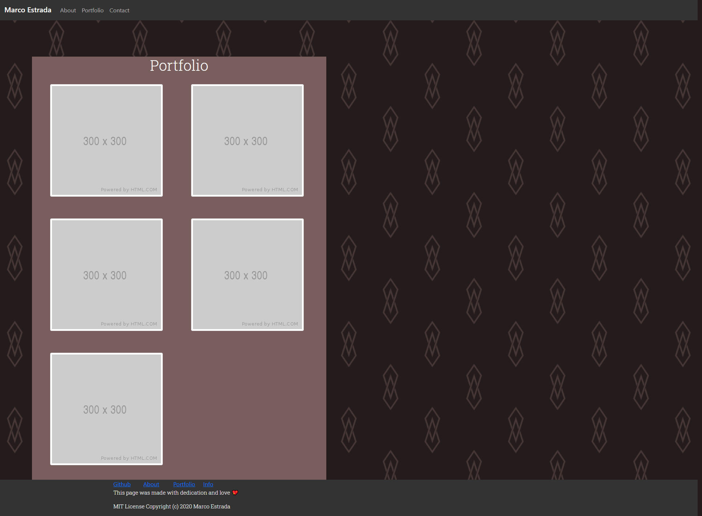
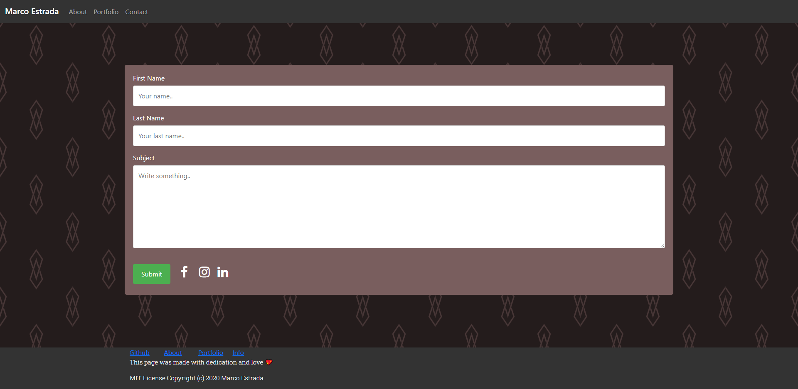

# MyPortfolio
## Info 

* This is my First Application, I added comments to describe each section to make it easier to read, and it was made it to share more about me.
* It was devoleped using.
* HTML
* CSS
* Bootstrap 

## Link 
[Marco's-Portfolio]( https://marcoc007.github.io/MyPortfolio/)

## Screenshots 

<!--  -->

* On the page I added a navigation bar in which each link works great!.
* I added my personal photo and a paragraph talking about me.
* I added a sticky footer with functional links.

<!--  -->

* On the page I added some placeholder images because I don't have any proyects photos yet, but when the days come I'll be updating the app.

<!--   -->

* On the last page I added a Contact Form with social media icons with the links from my social media profile.

